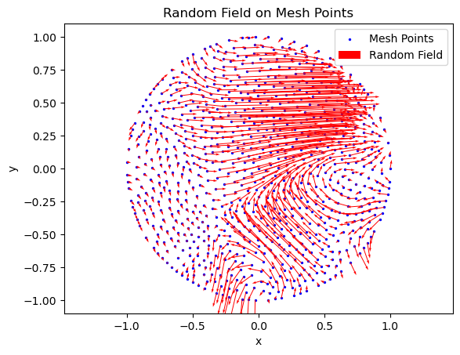
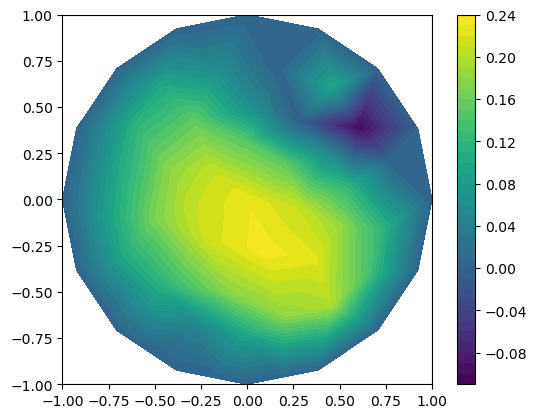

# Masterthesis

This is my Masterthesis with the title "Uncertainty Quantification of Stochastic Differential Equations on Random Domains"

The first notebook poisson_equation_harbrecht_covariance covers the Example 7.2 of [Analysis of the domain mapping method for elliptic diffusion problems on random domains](https://link.springer.com/article/10.1007/s00211-016-0791-4).

  
  
  

