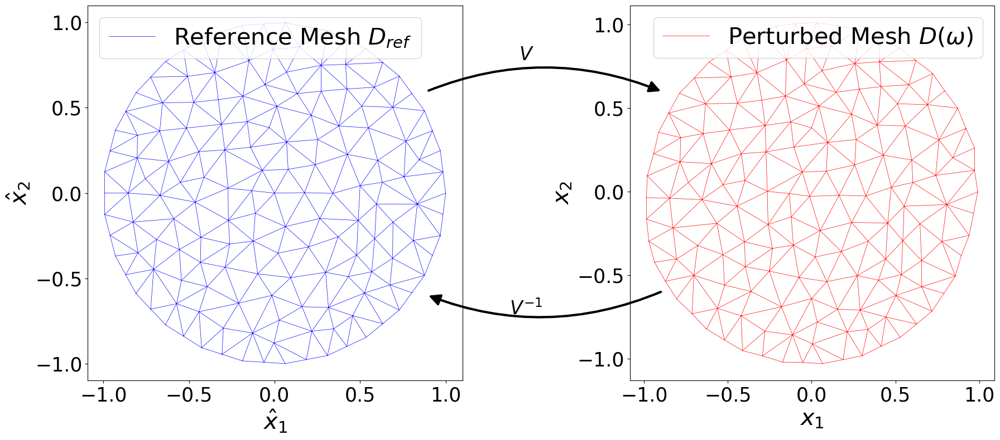

# Thesis Title: Uncertainty Quantification of PDEs with Random Parameters on Random Domains

**Author:** Elias Reutelsterz

**Affiliation:** Technical University of Munich, TUM School of Computation, Information and Technology

**Date:** 4. June, 2025

**Supervisor:** Prof. Elisabeth Ullmann

---

## 

## Table of Contents

1.  [Overview](#1-overview)
2.  [Mathematical Context](#2-mathematical-context)
3.  [Repository Structure](#3-repository-structure)
4.  [Dependencies](#4-dependencies)
5.  [Installation](#5-installation)
6.  [Usage](#6-usage)
7.  [Data and Output](#7-data-and-output)
8.  [Known Issues & Limitations](#8-known-issues--limitations)
9.  [License](#9-license)
10. [Citing This Work](#10-citing-this-work)
11. [Contact](#11-contact)

---

## 1. Overview

This repository contains the source code and resulting data of the Master's thesis titled "Uncertainty Quantification of PDEs with Random Parameters on Random Domains". The code implements the application of the so-called Domain Mapping Method on different PDEs with random parameters on different domains.

The primary goals of this codebase are:

- To numerically solve differential equations.
- To implement algorithms in the field of sensitivity analysis.
- To compute and model random fields.
- To generate data for statistal analysis of the PDE models.
- To visualize the domains, the sample solutions and the statistical results.

The implementation and the image generation support the theoretical arguments in the thesis document and should be used together.

---

## 2. Mathematical Context

The Domain Mapping Method is used to solve PDEs on a random domain. For this purpose, a mapping from the domain samples to a fixed reference domain is defined. This mapping results in an equivalent problem on the reference domain. This method is applied to a total of 5 different models. First to the Poisson equation defined on the unit disk

$$
\begin{align*} - \Delta u(x, \omega) &= 1 \hspace{1cm} \vert \hspace{1cm} x \in D(\omega) \\
u(x, \omega) &= 0 \hspace{1cm} \vert \hspace{1cm} x \in \delta D(\omega)
\end{align*}
$$

which is explained in chapter 4.
Two model adaptations are then considered, which are introduced in chapter 5.
Then the method is applied to an elasticity equation defined on a steel plate with uncertain geometry

$$
\begin{align*}
\frac{E(x, \omega_1)}{2 (1 + \nu)} \cdot \nabla^2 u(x, \omega) + \frac{E(x, \omega_1)}{2 (1 - \nu)} \cdot \nabla(\nabla \cdot u(x, \omega)) + b = 0 \hspace{1cm} & | \hspace{0.1cm} x \in D(\omega_2) \\
u(x, \omega) = 0 \hspace{1cm} & | \hspace{0.1cm} x \in \Gamma_1 \\
\sigma(u, x) \cdot n(x) = g \hspace{1cm} & | \hspace{0.1cm} x \in \Gamma_2.
\end{align*}
$$

This is explained in chapter 6 and comprehends two different options for modelling the uncertainty. First the circle in the middle of the steel plate is modelled with uniformly distributed random radius and random position. Then the circle is perturbed with a random field.

To model the random fields, their Karhunen-Loève expansion, introduced in chapter 2.2, is calculated. In addition, algorithms from sensitivity analysis are implemented to calculate Sobol' indices of the respective random variables. These are documented in chapter 3.4.

---

## 3. Repository Structure

```bash
├── images                                    # Images used in the thesis chapterwise.
├── poisson_and_variants                      # Code for Poisson model and its variants.
│   ├── diffusion                             # Code for the Diffusion model.
│   │   ├── __init__.py
│   │   ├── diffusion.ipynb                   # Overview notebook for visualization.
│   │   ├── diffusion_run_samples.py          # Calculate Monte Carlo samples.
│   │   ├── diffusion_run_sobols.py           # Calculate Sobol' index computation samples.
│   │   ├── helpers_diffusion.py              # Collection of functions and classes.
│   │   ├── mc_data_storage                   # Storage for Monte Carlo samples.
│   │   └── sobol_data_storage                # Storage for Sobol' index samples.
│   ├── poisson                               # Code for the Poisson model.
│   │   ├── __init__.py
│   │   ├── helpers.py                        # Collection of functions and classes.
│   │   ├── mc_data_storage                   # Storage for Monte Carlo samples.
│   │   ├── poisson.ipynb                     # Overview notebook for visualization.
│   │   ├── poisson_run_samples.py            # Calculate Monte Carlo samples.
│   │   ├── poisson_run_sobols.py             # Calculate Sobol' index computation samples.
│   │   └── sobol_data_storage                # Storage for Sobol' index samples.
│   └── poisson_rhs_random                    # Code for the right-hand side random Poisson model.
│       ├── __init__.py
│       ├── helpers_rhs_random.py             # Collection of functions and classes.
│       ├── mc_data_storage                   # Storage for Monte Carlo samples.
│       ├── poisson_rhs_random.ipynb          # Overview notebook for visualization.
│       ├── poisson_rhs_random_run_samples.py # Calculate Monte Carlo samples.
│       ├── poisson_rhs_random_run_sobols.py  # Calculate Sobol' index computation samples.
│       └── sobol_data_storage                # Storage for Sobol' index samples.
├── steel_plate_problem                       # Code for steel plate model.
│   ├── model_random_field                    # Code for steel plate model with random field circle perturbation.
│   │   ├── helpers.py                        # Collection of functions and classes.
│   │   ├── model.ipynb                       # Overview notebook for visualization.
│   │   ├── run_sobols.py                     # Calculate Sobol' index computation samples.
│   │   └── sobol_data_storage                # Storage for Sobol' index samples.
│   └── model_random_position_and_radius      # Code for steel plate model with random position and radius of the circle.
│       ├── helpers.py                        # Collection of functions and classes.
│       ├── mc_data_storage                   # Storage for Monte Carlo samples.
│       ├── model.ipynb                       # Overview notebook for visualization.
│       ├── run_samples.py                    # Calculate Monte Carlo samples.
│       ├── run_sobols.py                     # Calculate Sobol' index computation samples.
│       └── sobol_data_storage                # Storage for Sobol' index samples.
├── environment.yml                           # Conda environment configuration file.
├── LICENSE                                   # MIT License.
└── README.md                                 # This file.
```

---

## 4. Dependencies

This project requires the following software and Python packages.

- **Python:** Version `3.12.7`
- **Operating System:** Developed and tested on macOS Sequoia 15.3.2. Compatibility with other systems is not guaranteed but likely.

**Python Packages:**

While the full dependency list is in `environment.yml`, the core libraries central to this project include:

- **FEniCS Project (`fenics`, `fenics-dolfin`, `fenics-ffc`, etc.):** The primary finite element library used for solving partial differential equations.
- **NumPy (`numpy`):** Fundamental package for numerical computing with Python.
- **SciPy (`scipy`):** Used for scientific and technical computing, including numerical integration, optimization, and linear algebra.
- **Matplotlib (`matplotlib`):** For generating all plots and visualizations presented in the thesis.
- **JupyterLab (`jupyterlab`):** Provided for interactive exploration and generation of results via notebooks.
- **SymPy (`sympy`):** For symbolic mathematics.
- **Gmsh (`gmsh`):** Used for mesh generation.
- **Plotly (`plotly`):** For interactive data visualization.
- **Pandas (`pandas`):** For data manipulation and analysis, particularly with tabular data.

---

## 5. Installation

Follow these steps to set up the environment and prepare the code for execution.

1.  **Clone the Repository:**

    ```bash
    git clone https://github.com/EliasReutelsterz/Masterthesis.git
    cd masterthesis
    ```

2.  **Create a Virtual Environment (Recommended):**
    Using `conda`:

    ```bash
    conda env create -f environment.yml
    conda activate fenics_x64
    ```

3.  **Verify Installation (Optional):**
    You can run a simple test or check the version of a key package:
    ```bash
    python -c "import numpy; print(numpy.__version__)"
    ```

---

## 6. Usage

All applications and image generations can be found in the Jupyter notebooks of the respective models. Here you can then click on the underlying functions to examine the algorithms in the helpers files in more detail.
If you want to reproduce a specific figure from the thesis, you can search for it in the images and then search for the name of the graphic in the respective notebook. These are labeled so that you can find them quickly.

To calculate new samples, you must first navigate to the relevant model folder and then execute the run_samples.py or run_sobols.py file. The respective parameters can be passed in the console. Example:

```bash
cd poisson_and_variants/poisson

python poisson_run_samples.py --mc_samples 30 --fem_res 10 --kl_res 14
```

These scripts run in an infinite loop and are always saved after the specified --mc_samples. This means that any number of scripts can be run in parallel.

## 7. Data and Output

No input data is required. The output data is stored in the respective mc_data_storage and sobol_data_storage folders of the models and is also stored there when new samples are generated. Since the output data for the Sobol estimation and the Monte Carlo analyses are too large for the free Github version (and also the large file storage), all data is only pushed with a size of 100 samples. This means that the code can be executed, but much larger amounts of data are used in the thesis itself. The images used can therefore only be reproduced with the real data.

## 8. Known Issues & Limitations

The use of piecewise constant basis functions is mathematically inaccurate and the Jacobian of the random fields is thus approximated, which is explained in section 4.3. Since the Monte Carlo analyses and the Sobol' indices require many samples, the mesh resolutions for the FEM calculation of the PDE solutions and the KLE are only efficient to a very limited extent. The figures in the thesis are described with the respective mesh resolutions and the resulting sizes of the grid.

## 9. License

This code is released under the MIT License. See the LICENSE file for more details.

## 10. Citing This Work

If you use this code or concepts derived from it in your research, please cite the associated Master's thesis:

```
@mastersthesis{ReutelsterzThesis2025,
  author       = {Elias Reutelsterz},
  title        = {Uncertainty Quantification of PDEs with Random Parameters on Random Domains},
  school       = {Technical University of Munich},
  year         = {2025},
  type         = {Master's Thesis},
  url          = {https://github.com/EliasReutelsterz/Masterthesis}
}
```

## 11. Contact

For any questions, suggestions, or bug reports, please notify me directly or use the issue functionality of GitHub.
